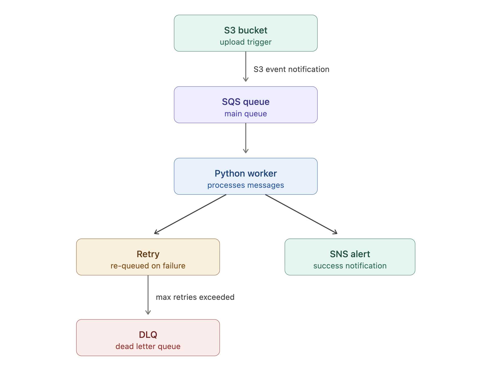

# Event-Driven File Processing System 🚀

This project demonstrates an event-driven AWS workflow using S3, SQS, SNS, and Python.

## 📌 Problem Statement

In cloud systems, file uploads often need to trigger downstream processing without tightly coupling storage and compute. A direct, synchronous design becomes harder to scale and recover from failures.

This project solves that by building an event-driven workflow where file uploads to S3 generate queue-based events that are processed asynchronously by a Python worker. The system also includes retry behavior, SNS notifications, and a dead-letter queue (DLQ) for failed messages.

---

## 📌 Overview

This system performs the following workflow:

- Uploads a file to Amazon S3
- Triggers an S3 object-created event
- Sends the event to Amazon SQS
- Uses a Python worker to read and process the queue message
- Publishes SNS notifications for processing outcomes
- Leaves failed messages in the queue for retry
- Routes repeated failures to a Dead Letter Queue (DLQ)

---

## 🧱 Architecture



### 🔍 How It Works

1. A file is uploaded to the S3 bucket.
2. S3 automatically generates an event notification.
3. The event is sent to an SQS queue.
4. A Python worker reads messages from the queue.
5. The worker processes the file:
   - On success → the message is deleted and a success notification is sent via SNS.
   - On failure → the message is not deleted, allowing SQS to retry it.
6. After multiple failed attempts, the message is moved to a Dead Letter Queue (DLQ).

### 🔍 How It Works

1. A file is uploaded to the S3 bucket.
2. S3 automatically generates an event notification.
3. The event is sent to an SQS queue.
4. A Python worker reads messages from the queue.
5. The worker processes the file:
   - On success → the message is deleted and a success notification is sent via SNS.
   - On failure → the message is not deleted, allowing SQS to retry it.
6. After multiple failed attempts, the message is moved to a Dead Letter Queue (DLQ).

S3 Bucket  
↓  
S3 Event Notification  
↓  
SQS Main Queue  
↓  
Python Worker  
↓  
SNS Notification  

Failed messages are retried automatically by SQS and routed to a DLQ after the configured max receive count is reached.

---

## 🧠 Design Decisions

- Used **S3 event notifications** to enable an event-driven architecture
- Used **SQS** to decouple file ingestion from processing for better scalability and resilience
- Used **SNS** to publish processing outcomes for downstream consumers
- Implemented a **DLQ pattern** to handle repeated failures safely
- Simulated failure scenarios (`sample.txt`) to demonstrate retry behavior

---

## ⚙️ Features

- S3 bucket creation
- SQS queue and DLQ creation
- SNS topic creation
- S3 → SQS event integration
- Python worker for queue polling
- Retry behavior using message visibility timeout
- SNS notifications for processing results
- Dead-letter queue configuration

---

## 🛠️ Tech Stack

- Python
- boto3
- PyYAML
- AWS S3
- AWS SQS
- AWS SNS

---

### 🚀 How to Run

1. Configure AWS credentials:

```bash
aws configure
```

2. Install dependencies:

```bash
pip install -r requirements.txt
```

3. Run the project:

```bash
python main.py
```
